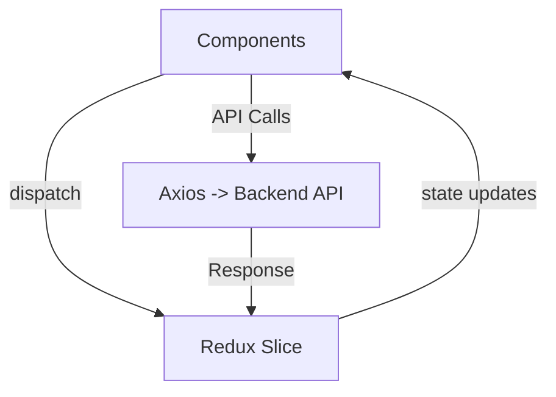

---

# 🏡 **MateMatch Frontend Architecture**

> **Tech Stack:**
> ⚛️ React (Vite) + 🌈 TailwindCSS + 🎨 Material Tailwind + 🔄 Redux Toolkit + ⚡ Axios + 🧭 React Router DOM v6

---

## 📁 **Folder Structure**

```
MateMatch-Frontend/
│
├── public/
│   └── favicon.ico               # App icon and static assets
│
├── src/
│   │
│   ├── components/               # UI Components
│   │   ├── Body.jsx
│   │   ├── Navbar.jsx
│   │   ├── Footer.jsx
│   │   ├── Feed.jsx
│   │   ├── Profile.jsx
│   │   ├── EditProfile.jsx
│   │   ├── Requests.jsx
│   │   ├── Connections.jsx
│   │   ├── UserCard.jsx
│   │   └── Login.jsx
│   │
│   ├── pages/                    # Route-based pages (optional)
│   │   ├── HomePage.jsx
│   │   ├── ProfilePage.jsx
│   │   ├── FeedPage.jsx
│   │   └── ErrorPage.jsx
│   │
│   ├── redux/                    # Redux Toolkit store management
│   │   ├── appStore.js
│   │   ├── userSlice.js
│   │   ├── feedSlice.js
│   │   ├── requestSlice.js
│   │   └── connectionSlice.js
│   │
│   ├── utils/                    # Helper functions
│   │   ├── constants.js          # API URLs, enums, config
│   │   ├── apiClient.js          # Axios instance setup
│   │   ├── authHelpers.js        # JWT/localStorage helpers
│   │   └── formValidators.js     # Validation logic
│   │
│   ├── router/                   # Centralized routing setup
│   │   └── AppRouter.jsx         # Routes configuration using React Router v6
│   │
│   ├── context/                  # Context API (if needed)
│   │   └── ThemeContext.jsx
│   │
│   ├── styles/                   # Custom CSS or Tailwind configs
│   │   └── index.css
│   │
│   ├── App.jsx                   # Main React component
│   ├── main.jsx                  # App entry point (Vite)
│   │
│   └── assets/                   # Local images, SVGs, icons
│       └── logo.svg
│
├── .env                          # Environment variables (e.g., VITE_API_URL)
├── .gitignore                    # Git ignore rules
├── eslint.config.js              # ESLint configuration
├── index.html                    # Root HTML template
├── package.json                  # Dependencies and scripts
├── package-lock.json
├── tailwind.config.js            # TailwindCSS configuration
├── postcss.config.js             # PostCSS config (used by Tailwind)
├── vite.config.js                # Vite configuration file
└── README.md                     # Project documentation
```

---

## 🧠 **Folder Breakdown**

### 🔹 **components/**

Reusable UI components for different sections of the app.

> Example: `UserCard`, `Feed`, `Requests`, `Profile`.

---

### 🔹 **pages/**

High-level route views linked to React Router DOM.

> Example: `/feed`, `/profile`, `/requests`.

---

### 🔹 **redux/**

Manages global app state using Redux Toolkit slices.

* `userSlice` → Handles authentication & user info
* `feedSlice` → Handles feed data (profiles)
* `requestSlice` → Handles connection requests
* `connectionSlice` → Stores accepted connections

---

### 🔹 **utils/**

Holds helper modules and configuration utilities.

* `constants.js` → API base URLs, global constants
* `apiClient.js` → Axios setup (with interceptors)
* `authHelpers.js` → LocalStorage/JWT helpers
* `formValidators.js` → Input validation logic

---

### 🔹 **router/**

Centralized route configuration using `react-router-dom@6`.

> Makes it easy to define private/public routes and layouts.

---

### 🔹 **context/**

Holds custom React Contexts (e.g., theme or auth).

---

### 🔹 **styles/**

Contains main stylesheet (`index.css`) or custom Tailwind extensions.

---

### 🔹 **assets/**

Static local media files like images or SVGs.

---

## 🧩 **Routing Structure Example**

```jsx
// src/router/AppRouter.jsx
import { BrowserRouter, Routes, Route } from "react-router-dom";
import Feed from "../components/Feed";
import Profile from "../components/Profile";
import EditProfile from "../components/EditProfile";
import Login from "../components/Login";

export default function AppRouter() {
  return (
    <BrowserRouter>
      <Routes>
        <Route path="/" element={<Feed />} />
        <Route path="/login" element={<Login />} />
        <Route path="/profile" element={<Profile />} />
        <Route path="/edit-profile" element={<EditProfile />} />
      </Routes>
    </BrowserRouter>
  );
}
```

---

## 🌈 **Tech Stack Overview**

| Layer            | Technology                          | Purpose                                     |
| ---------------- | ----------------------------------- | ------------------------------------------- |
| UI Framework     | **React + Vite**                    | Fast frontend development                   |
| Styling          | **TailwindCSS + Material Tailwind** | Utility-first styling + prebuilt components |
| State Management | **Redux Toolkit**                   | Centralized and predictable global state    |
| Routing          | **React Router DOM v6**             | SPA navigation                              |
| API Calls        | **Axios**                           | Simplified HTTP requests                    |
| Build Tool       | **Vite**                            | Lightweight dev server and build tool       |

---

## 🧭 **Data Flow (Frontend Perspective)**



---

## 💬 **Optional Add-ons**

* ✅ **Dark Mode / Theme Context**
* ⚡ **Socket.io-client** for real-time messaging
* ☁️ **Cloudinary** for profile photo uploads
* 🔐 **Protected Routes** using JWT validation

---

## 🎯 **Summary**

MateMatch Frontend is a **modular, scalable, and maintainable** React application built with:

* **Vite** for blazing-fast development
* **Tailwind + Material Tailwind** for a beautiful, responsive UI
* **Redux Toolkit** for consistent state management
* **React Router v6** for clean navigation

This structure ensures easy scalability, readability, and production readiness.

---
