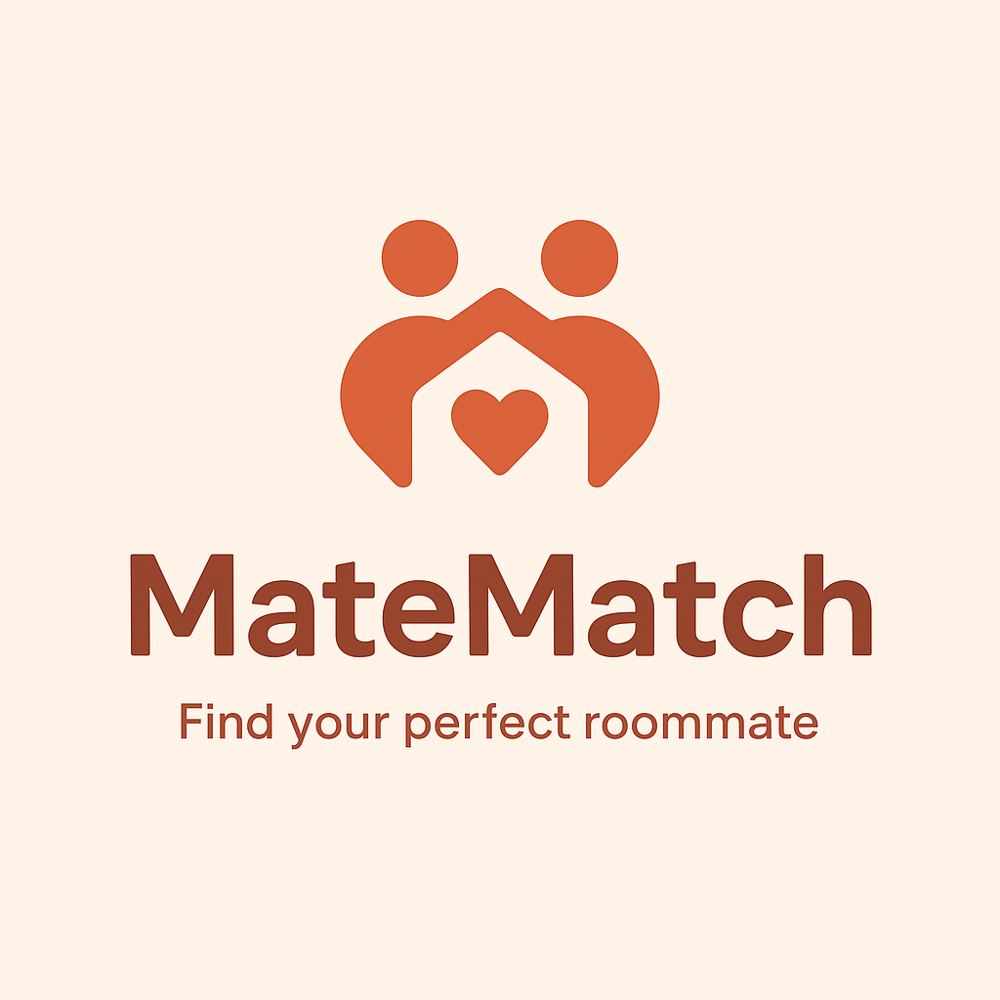
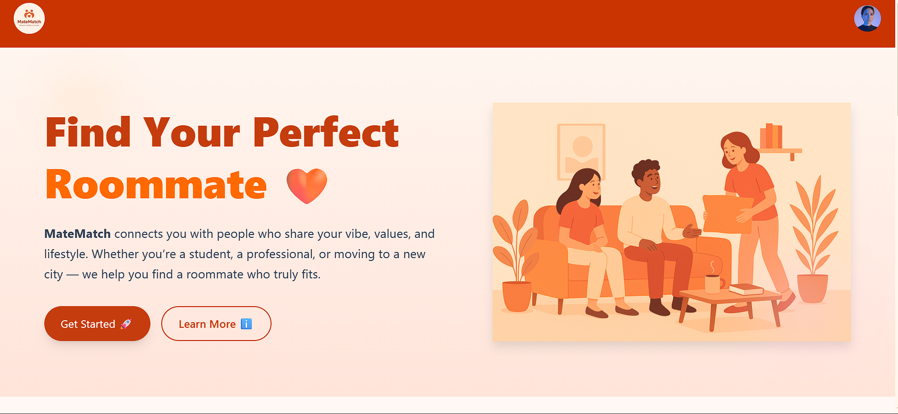

# 🏠 MateMatch

<p align="center">
  
</p>

> **Find your perfect roommate easily!**  
> MateMatch is a **MERN Stack** web application that helps students and professionals discover compatible roommates and shared accommodations 🧳👯‍♂️.

---

## 🖼️ Live Demo Preview

<p align="center">
  
</p>

<p align="center">
  <i>Beautiful, friendly, and modern roommate matching interface ✨</i>
</p>

---

## 🚀 Tech Stack

### 🖥️ Frontend


### ⚙️ Backend


---

## 🧩 Project Overview

MateMatch is a **full-stack roommate matching platform** that connects users looking for shared living spaces.  
It’s designed for **college students** and **working professionals** who’ve moved away from home and want to find a compatible roommate 🏡.

### ✨ Features
- 👤 Create a profile with your details, preferences, and location.
- 🏘️ Browse and connect with potential roommates near your area.
- 💬 Chat in real-time using live Socket.io messaging.
- 🎨 Enjoy a clean, responsive, and user-friendly UI powered by TailwindCSS + DaisyUI.
- 🔐 Secure authentication & authorization system with JWT.

---

## 🧠 Architecture

```mermaid
graph TD
A[User Interface 💻] -->|REST + WebSocket| B[React + Vite Frontend]
B -->|API Calls| C[Express Server ⚙️]
C -->|Database Queries| D[(MongoDB 🧩)]
C --> E[Socket.io 🔌 for Live Chat]
````

---

## ⚡ Folder Structure

```
MateMatch/
│
├── 📁 Backend/           # Node + Express + MongoDB
│   ├── server.js
│   ├── models/
│   ├── routes/
│   ├── controllers/
│   └── config/
│
├── 📁 Frontend/          # React + Vite + Redux + DaisyUI
│   ├── src/
│   ├── components/
│   ├── utils/
│   ├── images/
│   │   ├── logo.png
│   │   └── preview.png
│   └── ...
│
└── README.md
```

---

## 🧰 Installation & Setup

### 🔹 1. Clone the repository

```bash
git clone https://github.com/Ophidev/MateMatch.git
cd MateMatch
```

### 🔹 2. Setup the Backend

```bash
cd Backend
npm install
npm run dev
```

Create a `.env` file:

```env
PORT=5000
MONGO_URI=your_mongodb_connection_string
JWT_SECRET=your_secret_key
```

### 🔹 3. Setup the Frontend

```bash
cd Frontend
npm install
npm run dev
```

* Frontend → `http://localhost:5173`
* Backend → `http://localhost:5000`

---

## 🌐 Deployment

* **Frontend:** [Render](https://matematch-frontend.onrender.com)
* **Backend:** Hosted on Render or local server
* **Database:** MongoDB Atlas

---

## 🧑‍💻 Author

**👤 Aditya (Ophidev)**
💼 MERN Developer | 🚀 DevOps Learner
🔗 [GitHub](https://github.com/Ophidev)

---

## ⭐ Support

If you like this project, please **⭐ star** the repo and share it to help more people find their perfect roommate 🙌


